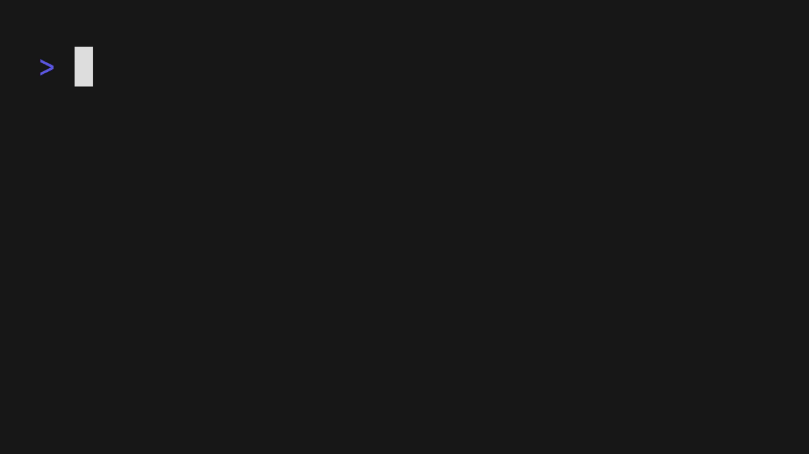

<p align="center">
  <a aria-label="Open Rodney Lab site" href="https://rodneylab.com" rel="nofollow noopener noreferrer">
    
  </a>
</p>
<h1 align="center">
  Countdown Numbers
</h1>

# countdown-numbers

Numbers Terminal game built using Ratatui in Rust. This code accompanies the <a href="https://rodneylab.com/trying-ratatui-tui/">blog post on trying Ratatui TUI</a>. If you have any questions, please drop a comment at the bottom of that page.

## Usage



Clone the repo then run:

```shell
cargo run
```

## ☎️ Issues

Feel free to jump into the
[Rodney Lab matrix chat room](https://matrix.to/#/%23rodney:matrix.org).
